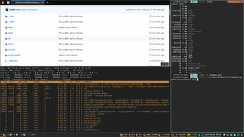
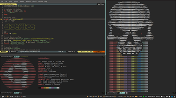
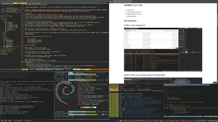
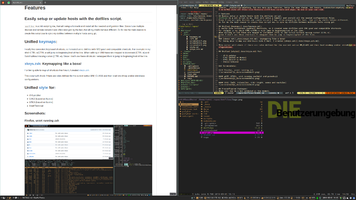

___DieBenutzerumgebung___ started as an collection of dofiles and an script to manage these.
The project now aims to go in the direction of a (somewhat) consistent desktop environment.

Right now we are on the path onto the first beta release including the new [dfp (dotfiles package) manager](docs/dfp.md).

We aren't 100% feature complete right now, but the master branch should always be in a functioning state.

- You can track the current progress
  * [in this project](https://github.com/users/DerBunman/projects/1)
  * [the next milestone (first beta)](https://github.com/DerBunman/DieBenutzerumgebung/milestone/1)
  * [planned features (after 0.0.1 release)](https://github.com/DerBunman/DieBenutzerumgebung/milestone/2)

If you have comments, ideas or requests, feel free to get involved.

# Main Features

## Unified keymaps
I really like consistent keyboard shortcuts. So I started to [define desktop wide shortcuts](docs/keymaps.md).

For example in my shell CTRL-a/CTRL-e will jump to beginning/end of the line.
When editing in VIM these are mapped to increment (CTRL-a) and Scroll without moving cursor (CTRL-e).
Since I don't use these shortcuts I remapped them to jump to beginning/end of the line.

### Systemwide, application based keybindings/remappings

Because some applications have not configureable shortcuts defined, [xkeys.zsh](docs/xkeys.zsh.md) will apply and then load xmodmap and/or xbindkeys configurations for the current focused application (identified by the active WM_CLASS).

More informations on [xkeys.zsh can be found here](docs/xkeys.zsh.md).

## Unified themes and style for:

  - i3 & polybar
  - GTK2 (based on oomox and Numix)
  - GTK3 (based on oomox and Numix)
  - Shell/Terminal


More informations on [theming and styling can be found here](docs/style.md).

The GTK themes and icons are located in [DerBunman/DieOberflaechengestaltung](https://github.com/DerBunman/DieOberflaechengestaltung).

Also note, that the oomox sources are included so you are able to customize the theme.

## DFP: dotfile package manager

_DFP_ stands for dotfiles package. It is the most recent addition in the _DieBenutzerumgebung_ project and handles installation and setup of packages and configurations, which in the end are the heart of the _DieBenutzerumgebung_ experience. So, next to the configuration and style concept, this is the main component of this project.

### Avaliable packages

A list of currently avaliable packages can be found [here](packages).

### DFP features

- internal reverse dependencies
- install dfp packages (including dependencies)
  - including reverse dependencies
  - automated building of .deb packages
- list packages (including installed)
- display package details
- update
  - single dfp package
  - self update and all packages

### Primary used applications:
* [i3wm](https://i3wm.org/)
* [zsh](https://www.zsh.org/) powered by [zplug](https://github.com/zplug/zplug) and the plugins listed here: [data/zshrc](data/zshrc)
* [vim](https://www.vim.org/) powered by [vim-plug](https://github.com/junegunn/vim-plug) and the plugins listed [here](https://github.com/DerBunman/DieBenutzerumgebung/blob/master/packages/vim/vim/vimrc_plug.vim)
* [polybar](https://github.com/jaagr/polybar)
* [nerdfonts](https://nerdfonts.com/)
* [dunst](https://dunst-project.org/)
* [gtk3 theme](https://www.gtk.org/)


# Installation

## Compatible distributions
- Debian >=10 (9 should also work but is untested)
- Ubuntu >=19.04
- Ubuntu 18.04 and Linux Mint 19.1 Tessa (which uses Ubuntu 18.04 as base):
	- This distribution has zsh 5.4.2 bundled. And there is some strange behavior in this version keeping the setup ui from working. [But you have multiple options.](docs/zsh_5.4.2.md)
- Other Debian based distributions should work too. You may have to change the sources.

Needed packages to run the setup installer are _git_ and _zsh >=5.5_.

The installer will install more packages.
For more infos, please have a look at the [package.dfp.zsh files for reference](https://github.com/DerBunman/DieBenutzerumgebung/blob/master/packages/urxvt/urxvt.dfp.zsh). Until it is documented.

## Initial setup

Please note, that all the apt dependencies have to be installed for [nonroot mode (WIP)](https://github.com/DerBunman/DieBenutzerumgebung/issues/15).

```zsh
sudo apt install zsh git
git clone --recursive https://github.com/DerBunman/DieBenutzerumgebung ~/.repos/dotfiles \
	&& ~/.repos/dotfiles/dotfiles setup
```
Please relogin after setup, so all the updated configs are parsed.

The setup command can be rerun at a later time, which will help you tune the configuration to your needs.

### Update
Dotfiles is now in your PATH so you can run the following command to update:
```zsh
dotfiles update
```

# Media
## Videos:

[preview of the new setup and installer script](https://streamable.com/za9ul)

## Screenshots:
<a href="docs/images/screenshot1.png" target="_blank">
	
</a>  
<br>
<a href="docs/images/screenshot1.png" target="_blank">
	Firefox, urxvt running zsh
</a>  
<br>
<a href="docs/images/screenshot2.png" target="_blank">
	
</a>  
<br>
<a href="docs/images/screenshot2.png" target="_blank">
	gVIM (GTK3), urxt running neofetch and pukeskull
</a>  
<br>
<a href="docs/images/screenshot3.png" target="_blank">
	
</a>  
<br>
<a href="docs/images/screenshot3.png" target="_blank">
	GTK2 (Filezilla), GTK3 (oomox, nautilus)
</a>  
<br>
<a href="docs/images/screenshot4.png" target="_blank">
	
</a>  
<br>
<a href="docs/images/screenshot4.png" target="_blank">
	gVIM (GTK3), Firefox and some terminals
</a>  
<br>
<a href="docs/images/screenshot5.png" target="_blank">
	
</a>  
<br>
<a href="docs/images/screenshot5.png" target="_blank">
	gVIM (GTK3), Firefox, and urxvt running ranger
</a>

