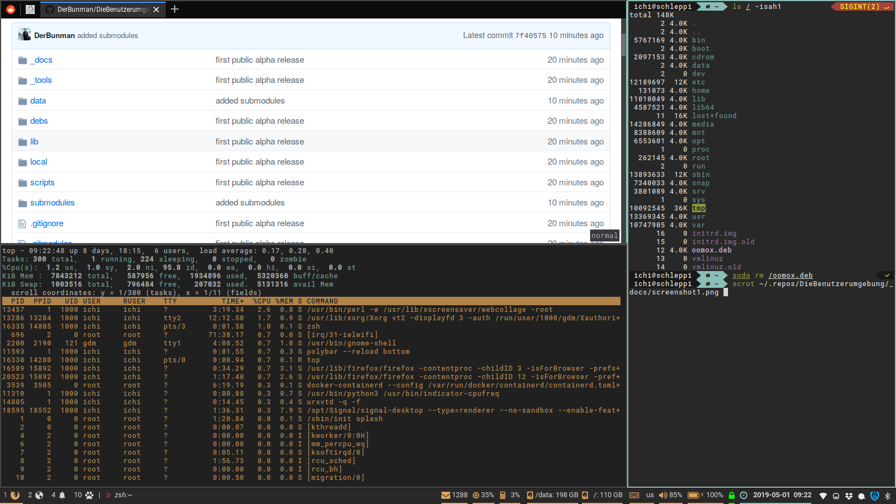
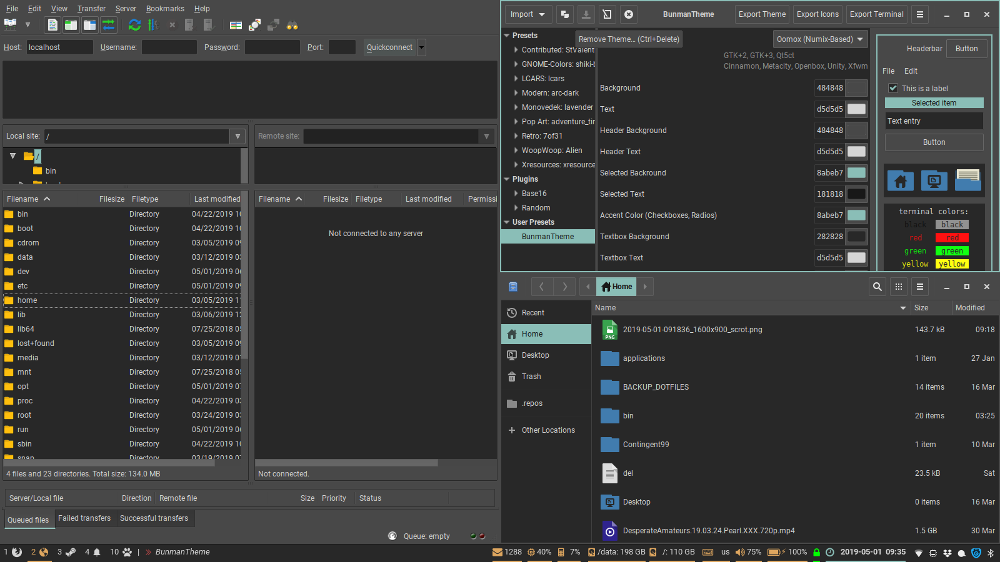

`DieBenutzerumgebung` started as a innocent collection of dofiles and an script to manager these dotfiles.

However, `DieBenutzerumgebung` has now many more features, hence the name change.

# Features
## Easily setup or update hosts with the dotfiles script.
`dotfiles` is a zsh script by me, that will setup a homedir and install all the needed configuration files.
Since I use multiple devices and remote servers I was often annoyed by the fact, that all my shells behave different.
So for me the main reason to create this script was to sync my dotfiles between multiple hosts using git.

## Unified [keymaps](_docs/keymaps.md):
I really like consistent keyboard shortcuts, so I created some dotfiles with IMO good and compatible shortcuts.
For example in my shell CTRL-a/CTRL-e will jump to beginning/end of the line.
When editing in VIM these are mapped to increment (CTRL-a) and Scroll without moving cursor (CTRL-e).
Since I don't use these shortcuts I remapped them to jump to beginning/end of the line.

### [xkeys.sh](_docs/xkeys.sh.md): Keymapping like a boss!
For being able to map all shortcuts like I want, I created [xkeys.zsh](_docs/xkeys.zsh.md).

This script will check if there are rules defined for the current active WM_CLASS and then load xmodmap and/or xbindkeys configurations.

## Unified [style](_docs/style.md) for:

  - i3 & polybar
  - GTK2 (based on Numix)
  - GTK3 (based on Numix)
  - Shell/Terminal

### Screenshots:

#### Firefox, urxvt running zsh


#### gVIM (GTK3), urxt running neofetch and pukeskull


#### GTK2 (left, Filezilla), GTK3 (right, oomox and nautilus)


## Preconfigured Packages:
This list may be a bit outdated at the moment.
### Shell
* [tmux](https://github.com/tmux/tmux)
* [mc](https://midnight-commander.org/)
* [zsh](https://www.zsh.org/) powered by [zplug](https://github.com/zplug/zplug) and the following plugins:
	* [zsh-users/zsh-completions](https://github.com/zsh-users/zsh-completions)
	* [zsh-users/zsh-history-substring-search](https://github.com/zsh-users/zsh-history-substring-search)
	* [zsh-users/zsh-autosuggestions](https://github.com/zsh-users/zsh-autosuggestions)
	* [zsh-users/zsh-syntax-highlighting](https://github.com/zsh-users/zsh-syntax-highlighting)
	* [k4rthik/git-cal](https://github.com/k4rthik/git-cal), as:command, frozen:1
	* [zlsun/solarized-man](https://github.com/zlsun/solarized-man)
	* [horosgrisa/mysql-colorize](https://github.com/horosgrisa/mysql-colorize), use:mysql-colorize.plugin.zsh
	* [zpm-zsh/ssh](https://github.com/zpm-zsh/ssh)
	* [zpm-zsh/colors](https://github.com/zpm-zsh/colors)
	* [joel-porquet/zsh-dircolors-solarized](https://github.com/joel-porquet/zsh-dircolors-solarized), use:zsh-dircolors-solarized.plugin.zsh
	* [jreese/zsh-titles](https://github.com/jreese/zsh-titles)
	* [marzocchi/zsh-notify](https://github.com/marzocchi/zsh-notify)
	* [bhilburn/powerlevel9k](https://github.com/bhilburn/powerlevel9k), use:powerlevel9k.zsh-theme
	* "plugins/ssh-agent", from:oh-my-zsh
	* "plugins/git", from:oh-my-zsh
	* "plugins/colorize", from:oh-my-zsh
	* "plugins/history", from:oh-my-zsh
	* "plugins/tmux", from:oh-my-zsh
	* "plugins/systemd", from:oh-my-zsh
	* "plugins/docker", from:oh-my-zsh

* [vim](https://www.vim.org/) powered by [vim-plug](https://github.com/junegunn/vim-plug) and the following plugins:
	* [tpope/vim-fugitive](https://github.com/tpope/vim-fugitive) (dep for airline)
	* [vim-airline/vim-airline](https://github.com/vim-airline/vim-airline)
	* [vim-airline/vim-airline-themes](https://github.com/vim-airline/vim-airline-themes)
	* [sheerun/vim-polyglot](https://github.com/sheerun/vim-polyglot)
	* [StanAngeloff/php.vim](https://github.com/StanAngeloff/php.vim)
	* [scrooloose/nerdtree](https://github.com/scrooloose/nerdtree)
	* [flazz/vim-colorschemes](https://github.com/flazz/vim-colorschemes)
	* [pangloss/vim-javascript](https://github.com/pangloss/vim-javascript)
	* [tpope/vim-surround](https://github.com/tpope/vim-surround)
	* [scrooloose/syntastic](https://github.com/scrooloose/syntastic)
	* [vim-scripts/Align](https://github.com/vim-scripts/Align)
	* [evidens/vim-twig](https://github.com/evidens/vim-twig)
	* [ap/vim-css-color](https://github.com/ap/vim-css-color)
	* [sjl/gundo.vim](https://github.com/sjl/gundo.vim)
	* [mileszs/ack.vim](https://github.com/mileszs/ack.vim)
	* [ajh17/VimCompletesMe](https://github.com/ajh17/VimCompletesMe)
	* [ctrlpvim/ctrlp.vim](https://github.com/ctrlpvim/ctrlp.vim)
	* [ryanoasis/vim-devicons](https://github.com/ryanoasis/vim-devicons)
	* [ludovicchabant/vim-gutentags](https://github.com/ludovicchabant/vim-gutentags)

### X11
* [i3wm](https://i3wm.org/)
* [polybar](https://github.com/jaagr/polybar)
* [nerdfonts](https://nerdfonts.com/)
* [dunst](https://dunst-project.org/)
* [gtk3 theme](https://www.gtk.org/)

# Installation
## Installation via SSH
```zsh
apt install zsh git
mkdir -p ~/.repos \
	&& git clone --recursive git@github.com:DerBunman/DieBenutzerumgebung.git ~/.repos/dotfiles \
	&& ~/.repos/dotfiles/dotfiles init [shell/shell_and_x11/nonroot_shell]
```

## Installation via HTTP
```zsh
sudo apt install zsh git
mkdir -p ~/.repos \
	&& git clone --recursive https://github.com/DerBunman/dotfiles ~/.repos/dotfiles \
	&& ~/.repos/dotfiles/dotfiles init [shell/shell_and_x11/nonroot_shell]
```

## Examples
The init process will most likely fail in the first stage (symlink check) because there are already some dotfiles in your homedir.
If it fails just remove the existing files and re-run the command ```dotfiles init nonroot_shell```
### Shell only (non root)
#### Initial setup
Please note, that the dependencies have to be installed for nonroot mode.

```zsh
sudo apt install zsh git
mkdir -p ~/.repos \
	&& git clone --recursive git@github.com:DerBunman/DieBenutzerumgebung.git ~/.repos/dotfiles \
	&& ~/.repos/dotfiles/dotfiles init nonroot_shell
```
Please relogin after init so all the updated configs are parsed.

### Shell only (with root)
#### Initial setup
Please note, that the dependencies will be auto installed in the init process.

```zsh
sudo apt install zsh git
mkdir -p ~/.repos \
	&& git clone --recursive git@github.com:DerBunman/DieBenutzerumgebung.git ~/.repos/dotfiles \
	&& ~/.repos/dotfiles/dotfiles init shell
```
Please relogin after init so all the updated configs are parsed.

### Shell and x11 (with root)
#### Initial setup
Please note, that the dependencies will be auto installed in the init process.

```zsh
sudo apt install zsh git
mkdir -p ~/.repos \
	&& git clone --recursive git@github.com:DerBunman/DieBenutzerumgebung.git ~/.repos/dotfiles \
	&& ~/.repos/dotfiles/dotfiles init shell_and_x11
```
Please relogin into i3 after init so all the updated configs are parsed.


### Update (all modes)
Dotfiles is now in your PATH so you can run the following command to update:
```zsh
dotfiles update
```
