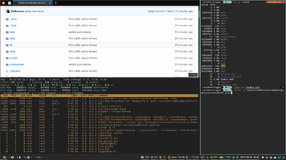
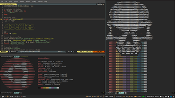
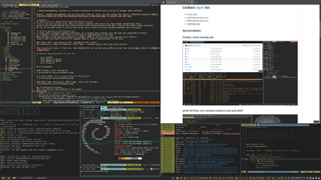
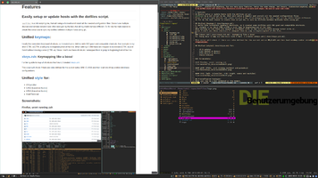

__DieBenutzerumgebung__ started as a innocent collection of dofiles and an script to manager these dotfiles.

However, __DieBenutzerumgebung__ has now many more features, hence the name change.
But beware, __DieBenutzerumgebung__ is still in ALPHA state all these nice features still have corners and edges.
Also, there may be changes to everything.

So use at your own risk.

# Table of Contents
* [Dependencies](#dependencies)
* [Features](#features)
	* [Easily setup or update hosts with the dotfiles script.](#easily-setup-or-update-hosts-with-the-dotfiles-script)
	* [Unified keymaps](#unified-keymaps)
		* [xkeys.zsh: Keymapping like a boss!](#xkeyszsh-keymapping-like-a-boss)
	* [Unified style](#unified-style-for)
* [Videos](#videos)
* [Screenshots](#screenshots)
* [Preconfigured Packages](#preconfigured-packages)
* [Installation](#installation)
	* [Installation via SSH](#installation-via-ssh)
	* [Installation via HTTP](#installation-via-http)
	* [Examples](#examples)
		* [Shell only (non root)](#shell-only-non-root)
		* [Shell only (with root)](#shell-only-with-root)
		* [Shell and x11 (with root)](#shell-and-x11-with-root)
		* [Update (all modes)](#update-all-modes)
* [Inspirations and credits](_docs/inspirations_and_credits.md)

# Dependencies
* Compatible distributions
  - Debian 9 - 10
  - Ubuntu 18.04 - 19.04
  - Other Debian based distributions should work too, however, you have to compile polybar yourself.
  - Other non Debian based distributions should work too, however, you have to install all needed packages without the script. _(for now)_
* Needed packages to run the installeri are: git, curl, zsh
* [Packages that the dotfiles script will install.](https://github.com/DerBunman/DieBenutzerumgebung/blob/v0.0.1-alpha1/dotfiles#L255)

# Features
## Easily setup or update hosts with the dotfiles script.
`dotfiles` is a zsh script by me, that will setup a homedir and install all the needed configuration files.
Since I use multiple devices and remote servers I was often annoyed by the fact, that all my shells behave different.
So for me the main reason to create this script was to sync my dotfiles between multiple hosts using git.

## Unified [keymaps](_docs/keymaps.md):
I really like consistent keyboard shortcuts, so I created some dotfiles with IMO good and compatible shortcuts.
For example in my shell CTRL-a/CTRL-e will jump to beginning/end of the line.
When editing in VIM these are mapped to increment (CTRL-a) and Scroll without moving cursor (CTRL-e).
Since I don't use these shortcuts I remapped them to jump to beginning/end of the line.

### [xkeys.zsh](_docs/xkeys.zsh.md): Keymapping like a boss!
For being able to map all shortcuts like I want, I created [xkeys.zsh](_docs/xkeys.zsh.md).

This script will check if there are rules defined for the current active WM_CLASS and then load xmodmap and/or xbindkeys configurations.

## Unified [style](_docs/style.md) for:

  - i3 & polybar
  - GTK2 (based on Numix)
  - GTK3 (based on Numix)
  - Shell/Terminal

## Videos:
<a href="https://youtu.be/n_71Ccq8z8Q" target="_blank">
	
</a>

## Screenshots:
<a href="_docs/images/screenshot1.png" target="_blank">
	
</a>  
<br>
<a href="_docs/images/screenshot1.png" target="_blank">
	Firefox, urxvt running zsh
</a>  
<br>
<a href="_docs/images/screenshot2.png" target="_blank">
	
</a>  
<br>
<a href="_docs/images/screenshot2.png" target="_blank">
	gVIM (GTK3), urxt running neofetch and pukeskull
</a>  
<br>
<a href="_docs/images/screenshot3.png" target="_blank">
	
</a>  
<br>
<a href="_docs/images/screenshot3.png" target="_blank">
	GTK2 (Filezilla), GTK3 (oomox, nautilus)
</a>  
<br>
<a href="_docs/images/screenshot4.png" target="_blank">
	
</a>  
<br>
<a href="_docs/images/screenshot4.png" target="_blank">
	gVIM (GTK3), Firefox and some terminals
</a>  
<br>
<a href="_docs/images/screenshot5.png" target="_blank">
	
</a>  
<br>
<a href="_docs/images/screenshot5.png" target="_blank">
	gVIM (GTK3), Firefox, and urxvt running ranger
</a>

## Preconfigured Packages:
### Shell
* [tmux](https://github.com/tmux/tmux)
* [zsh](https://www.zsh.org/) powered by [zplug](https://github.com/zplug/zplug) and the plugins listed here: [data/zshrc](data/zshrc)
* [vim](https://www.vim.org/) powered by [vim-plug](https://github.com/junegunn/vim-plug) and the plugins listed here [data/vim/vimrc_plug.vim](data/vim/vimrc_plug.vim)

### X11
* [i3wm](https://i3wm.org/)
* [polybar](https://github.com/jaagr/polybar)
* [nerdfonts](https://nerdfonts.com/)
* [dunst](https://dunst-project.org/)
* [gtk3 theme](https://www.gtk.org/)

# Installation

## Hints
The init process may fail in the first stage (symlink check) because there are already some dotfiles in your homedir.
In most cases the dotfiles script will be able to fix it by itself. Just follow the instructions on the screen.

### Initial setup
The init command will also run a dialog wizard which will help you tune the configuration to your needs.

Please note, that the dependencies have to be installed for nonroot mode.

```zsh
sudo apt install zsh git curl dialog
mkdir -p ~/.repos \
	&& git clone --recursive git@github.com:DerBunman/DieBenutzerumgebung.git ~/.repos/dotfiles \
	&& ~/.repos/dotfiles/dotfiles init
```
Please relogin after init so all the updated configs are parsed.

### Update
Dotfiles is now in your PATH so you can run the following command to update:
```zsh
dotfiles update
```
