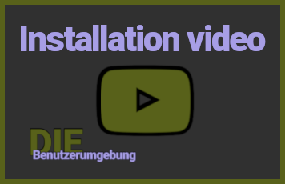
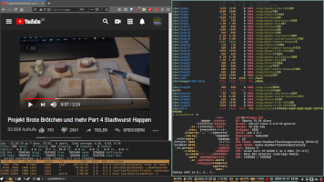

___DieBenutzerumgebung___ started as an collection of dofiles and an script to manage these.
The project now aims to provide a (somewhat) consistent desktop environment experience.

- You can track the current progress
  * [in this project](https://github.com/users/DerBunman/projects/1)
  * [planned features (after 0.0.2 release)](https://github.com/DerBunman/DieBenutzerumgebung/milestone/2)

If you have comments, ideas or requests, feel free to get involved.

# Main Features

## Unified keymaps
I really like consistent keyboard shortcuts. So I started to [define desktop wide shortcuts](docs/keymaps.md).

For example in my shell CTRL-a/CTRL-e will jump to beginning/end of the line.
When editing in VIM these are mapped to increment (CTRL-a) and Scroll without moving cursor (CTRL-e).
Since I don't use these shortcuts I remapped them to jump to beginning/end of the line.

### Systemwide, application based keybindings/remappings

Because some applications have not configureable shortcuts defined, [xkeys.zsh](docs/xkeys.zsh.md) will apply and then load xmodmap and/or xbindkeys configurations for the current focused application (identified by the active WM_CLASS).

More informations on [xkeys.zsh can be found here](docs/xkeys.zsh.md).

## Unified themes and style for:

  - bspwm & polybar
  - GTK2 (based on oomox and Numix)
  - GTK3 (based on oomox and Numix)
  - Shell/Terminal

More informations on [theming and styling can be found here](docs/style.md).

The GTK themes and icons are generated on the fly using oomox.

Also note, that the oomox sources are included so you are able to customize the theme.

### Preconfigured applications and packages:
* [bspwm](https://github.com/baskerville/bspwm)
* [zsh](https://www.zsh.org/) powered by [zgen](https://github.com/tarjoilija/zgen) and the plugins listed [here](roles/common/files/dotfiles/.zshrc.zgen).
* [vim](https://www.vim.org/) powered by [vim-plug](https://github.com/junegunn/vim-plug) and the plugins listed [here](roles/common/files/dotfiles/.vim/vimrc_plug.vim).
* [polybar](https://github.com/jaagr/polybar)
* [nerdfonts](https://nerdfonts.com/)
* [dunst](https://dunst-project.org/)
* [gtk3 theme](https://www.gtk.org/)
* [feh](https://github.com/derf/feh)
* [ranger](https://github.com/ranger/ranger)
* [udiskie](https://github.com/coldfix/udiskie)
* [urxvt](https://sourceforge.net/projects/rxvt/)
* [compton](https://github.com/chjj/compton)
* ssh-client including ssh-agent
* top

# Installation

## Compatible distributions
- Debian >=10
- Ubuntu >=18.04 and Linux Mint 19.1 Tessa (which uses Ubuntu 18.04 as base) should also work.
- Other Debian based distributions should work too. You may have to change the sources.

## Examples
### Basic install (like in the video)
These instructions have been tested on Ubuntu 19.10.

#### First we ensure that ansible and git are installed.
```sh
sudo apt-get install ansible git
```

#### Before you start, you'll need to setup a password for the ansible-vault.
```sh
test -e ~/.ansible_vault_password || openssl rand -base64 20 > ~/.ansible_vault_password
chmod 400 ~/.ansible_vault_password
```

#### Then you can clone the repository.
```sh
git clone https://github.com/DerBunman/DieBenutzerumgebung --branch=master --single-branch ~/DieBenutzerumgebung
```

#### And then you'll setup your environment.
```sh
cd ~/DieBenutzerumgebung/inventories/
cp localhost.yml default.yml
```
Edit default.yml according your needs.
More information on how to configure the hosts can be found [here](docs/variables.md).

The minimal change would be to replace your_user with the current user.

For example:
```sh
sed "s/your_user/$USER/" -i default.yml
```
then continue here:
```sh
cd ..
cp secrets.example.yml secrets.yml
ansible-vault encrypt secrets.yml
ansible-vault edit secrets.yml
ansible-galaxy install -r requirements.yml
```

#### Finally run the ansible playbook.
```sh
ansible-playbook playbook.yml --ask-become-pass
```

Done. Just logout and login again using the bspwm session.

### Upgrade basic install
```sh
cd ~/DieBenutzerumgebung/
git pull
ansible-playbook playbook.yml --ask-become-pass
```

# Media
## Videos:
The the source files for all official videos will be released in the [___DieGebrauchsanweisung___](https://github.com/DerBunman/DieGebrauchsanweisung) repository.

### Official YouTube channel
The newest videos can always be found in the [___official YouTube channel___](https://www.youtube.com/channel/UC9JQ_zd0TFrX8pKJucOKTGQ/).

### Demonstration of some basic features.

<a href="https://www.youtube.com/watch?v=8RWfljLYXvw" target="_blank">

</a>  

### Example installation process on a fresh installed Ubuntu 19.10 VM.

<a href="https://www.youtube.com/watch?v=lV1Vl4LM4Bo" target="_blank">

</a>  

## Screenshots:
<a href="docs/images/screenshot1.png" target="_blank">
	
</a>  
<br>
<a href="docs/images/screenshot1.png" target="_blank">
	Firefox, urxvt running zsh
</a>  
<br>
<a href="docs/images/screenshot2.png" target="_blank">
	
</a>  
<br>
<a href="docs/images/screenshot2.png" target="_blank">
	gVIM (GTK3), urxt running neofetch and pukeskull
</a>  
<br>
<a href="docs/images/screenshot3.png" target="_blank">
	
</a>  
<br>
<a href="docs/images/screenshot3.png" target="_blank">
	GTK2 (Filezilla), GTK3 (oomox, nautilus)
</a>  
<br>
<a href="docs/images/screenshot4.png" target="_blank">
	
</a>  
<br>
<a href="docs/images/screenshot4.png" target="_blank">
	gVIM (GTK3), Firefox and some terminals
</a>  
<br>
<a href="docs/images/screenshot5.png" target="_blank">
	
</a>  
<br>
<a href="docs/images/screenshot5.png" target="_blank">
	gVIM (GTK3), Firefox, and urxvt running ranger
</a><br>
<a href="docs/images/screenshot6.png" target="_blank">
	
</a>  
<br>
<a href="docs/images/screenshot6.png" target="_blank">
	Firefox and two shells
</a>


